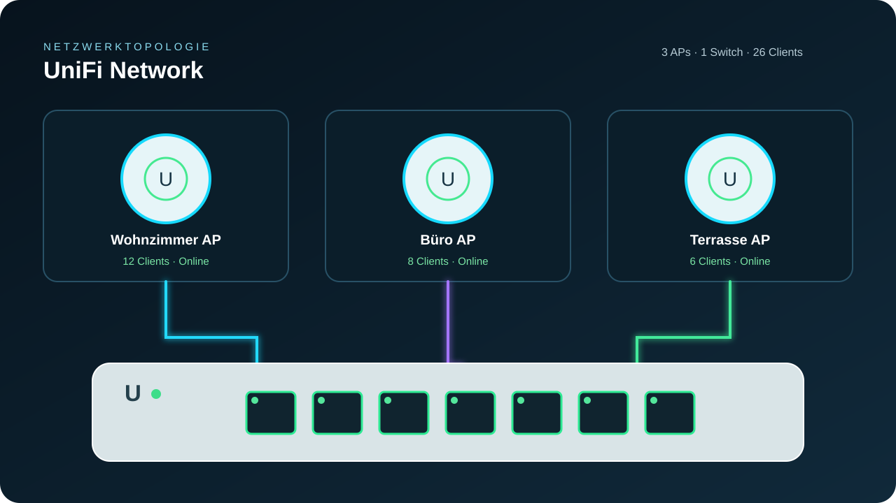

# Ubiquiti Network Dashboard

Eine moderne, lokal laufende Lovelace-Karte für Home Assistant. Sie stellt
UniFi Access Points, Switches, aktive Ports und deren Uplinks als kompakte
Netzwerktopologie dar.

> Diese Dashboard-Karte nutzt bestehende UniFi- oder Ubiquiti-Entitäten. Sie
> ersetzt weder die offizielle UniFi-Integration noch verbindet sie sich direkt
> mit einem Controller.

## Funktionen

- Access Points mit Online-Status, Modell, Client-Anzahl und optionalen
  Band-Metriken
- Switches als Geräteansicht mit konfigurierten Ports, Link-Status, PoE und
  optionaler Geschwindigkeit
- Farbige Uplink-Linien zwischen AP und Switch-Port
- Responsive Darstellung, Home-Assistant-Theme-Variablen und keine externen
  Abhängigkeiten
- Nativer Lovelace-UI-Editor für Titel, APs, Switches, Ports und Uplinks
- Automatische Entitätserkennung mit übernehmbaren AP-, Switch- und
  Port-Vorschlägen
- Klick auf ein Gerät oder einen Port öffnet dessen Home-Assistant-Detaildialog

## Installation über HACS

1. Öffne **HACS → Dashboards** und wähle **Custom repository**.
2. Füge https://github.com/404GamerNotFound/ha-ubiquiti-dashboard als Typ
   **Dashboard** hinzu.
3. Installiere **Ubiquiti Network Dashboard**.
4. Aktualisiere Home Assistant vollständig, einschließlich Browser-Cache.
5. Öffne dein Dashboard, füge eine Karte hinzu und wähle
   **Ubiquiti Network Dashboard**. Im visuellen Editor lassen sich Entitäten,
   Geräte, Ports und Uplinks konfigurieren; der YAML-Modus bleibt ebenfalls
   verfügbar.

HACS registriert die Ressource automatisch. Bei einer manuellen Installation
ist die Modulressource:

~~~yaml
url: /hacsfiles/ha-ubiquiti-dashboard/ha-ubiquiti-dashboard.js
type: module
~~~

## Automatische Erkennung

Im visuellen Editor steht unter **Automatische Erkennung** die Aktion
**Entitäten analysieren** zur Verfügung. Sie durchsucht die vorhandenen
Home-Assistant-Entitäten nach den üblichen UniFi-Portmustern und schlägt
Switches, ihre Ports sowie erkannte Access Points vor. Die Vorschläge werden
erst durch **übernehmen** in die Kartenkonfiguration geschrieben; Uplink-Ziele
werden dabei bewusst nicht geraten und anschließend im Editor ergänzt.

## Schnellstart

Ersetze die Beispiel-Entitäts-IDs durch die Entitäten deiner Installation:

~~~yaml
type: custom:ha-ubiquiti-dashboard
title: Mein Netzwerk
theme: auto # auto, dark oder light
access_points:
  - name: Wohnzimmer AP
    model: U6+
    status_entity: binary_sensor.wohnzimmer_ap_status
    clients_entity: sensor.wohnzimmer_ap_clients
    bands:
      - label: 2,4 GHz
        entity: sensor.wohnzimmer_ap_24ghz_clients
      - label: 5 GHz
        entity: sensor.wohnzimmer_ap_5ghz_clients
    uplink:
      switch: USW Wohnzimmer
      port: 8
  - name: Büro AP
    model: U6 Pro
    status_entity: binary_sensor.buero_ap_status
    clients_entity: sensor.buero_ap_clients
    uplink:
      switch: USW Wohnzimmer
      port: 6
switches:
  - name: USW Wohnzimmer
    model: USW Lite 8 PoE
    status_entity: binary_sensor.usw_wohnzimmer_status
    ports:
      - number: 1
        name: Home Assistant
        status_entity: binary_sensor.usw_wohnzimmer_port_1
        speed_entity: sensor.usw_wohnzimmer_port_1_speed
      - number: 6
        name: Büro AP
        status_entity: binary_sensor.usw_wohnzimmer_port_6
        poe_entity: binary_sensor.usw_wohnzimmer_port_6_poe
      - number: 8
        name: Wohnzimmer AP
        status_entity: binary_sensor.usw_wohnzimmer_port_8
        poe_entity: binary_sensor.usw_wohnzimmer_port_8_poe
~~~

## Konfigurationsreferenz

| Schlüssel | Typ | Beschreibung |
| --- | --- | --- |
| title | Text | Titel der Karte; Standard: UniFi Network |
| theme | auto, dark, light | Farbmodus der Karte |
| access_points | Liste | APs, die oberhalb der Switches erscheinen |
| switches | Liste | Switches mit den darzustellenden Ports |
| group / area | Text | Optionale Gruppierung von Switches, etwa nach Etage oder Raum |
| collapsed | Boolean | Blendet die Portansicht des Switches beim Laden ein oder aus |
| status_entity | Entity-ID | Optionaler Online-Status eines AP, Switches oder Ports |
| clients_entity | Entity-ID | Zustand wird als Client-Anzahl angezeigt |
| speed_entity | Entity-ID | Optionaler Text unter einem Port, etwa 1 Gbit/s |
| rx_entity / tx_entity | Entity-ID | Optionaler aktueller Empfangs- bzw. Sendendurchsatz eines Ports |
| poe_entity | Entity-ID | Bei on erscheint am Port ein PoE-Symbol |
| poe_power_entity | Entity-ID | Optionale aktuelle PoE-Leistung unter dem Port, etwa 7,90 W |
| poe_budget_entity / poe_budget | Entity-ID / Zahl | Optionales PoE-Watt-Budget eines Switches |
| poe_usage_entity | Entity-ID | Optionaler Gesamtverbrauch; sonst werden die PoE-Portwerte summiert |
| uplink.switch / uplink.port | Text / Zahl | Verknüpft einen AP mit einem Switch-Port |
| uplink.local_port | Zahl | Optionaler Quell-Port für eine Switch-zu-Switch-Verbindung |

Die kürzeren Aliasse entity, clients, poe, poe_power, poe_usage, rx, tx und speed werden ebenfalls akzeptiert.
Die Statusauswertung behandelt on, online, connected und up als online; off,
unavailable, unknown, disconnected und down als offline.

Switches mit mindestens einer group- oder area-Angabe werden im Dashboard unter
dieser Überschrift zusammengefasst. Über die Pfeil-Schaltfläche im Kopf eines
Switches lässt sich die Portansicht ein- und ausklappen; beim Einklappen werden
die Leitungen zu diesem Switch ausgeblendet.

~~~yaml
switches:
  - name: Heizungsraum
    group: Keller
  - name: Dachboden
    group: Dachgeschoss
    collapsed: true
~~~

Ein Switch-Uplink wird am Switch selbst hinterlegt. local_port ist der Port am
dargestellten Switch; switch und port bezeichnen den Ziel-Switch und dessen
Ziel-Port:

~~~yaml
switches:
  - name: Dachboden
    uplink:
      switch: Heizungsraum
      port: 3
      local_port: 1
~~~

## HACS- und Entwicklungsstandard

Das Repository ist als HACS-Typ **Dashboard** aufgebaut, der im HACS-Backend
technisch **plugin** heißt.

- hacs.json enthält Namen, installierbare Ressource, README-Darstellung und die
  minimale Home-Assistant-Version.
- dist/ha-ubiquiti-dashboard.js ist die installierbare, namensgleiche
  JavaScript-Ressource.
- Die GitHub Action prüft das Repository mit der offiziellen HACS-Validierung
  sowie die JavaScript-Syntax bei Pushes und Pull Requests.
- Für die Aufnahme in die HACS-Standardliste müssen auf GitHub zusätzlich eine
  Repository-Beschreibung, passende Topics, aktivierte Issues, ein öffentliches
  Repository und ein GitHub Release eingerichtet sein.

## Entwicklung

~~~bash
npm run build
npm run check
~~~

src/ha-ubiquiti-dashboard.js ist die Quelldatei. Der Build kopiert die
abhängigkeitsfreie Auslieferungsdatei nach dist; diese Datei muss in Releases
eingecheckt bleiben, damit HACS sie ohne Build-Schritt installieren kann.

## Lizenz und Marken

MIT. UniFi und Ubiquiti sind Marken ihrer jeweiligen Inhaber. Dieses Projekt
steht in keiner Verbindung zu Ubiquiti Inc.
