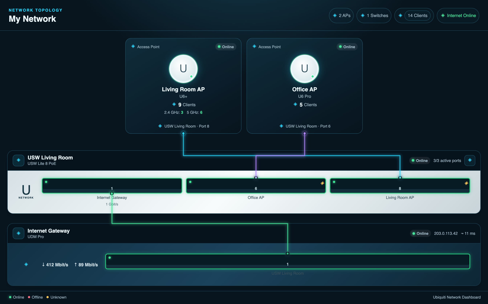

# Ubiquiti Network Dashboard

A modern, locally running Lovelace card for Home Assistant. It displays UniFi
access points, switches, active ports, and their uplinks as a compact network
topology.

> This dashboard card uses existing UniFi or Ubiquiti entities. It does not
> replace the official UniFi integration and does not connect directly to a
> controller.

## Features

- Access points with online status, model, client count, and optional band
  metrics
- Switches as a device view with configured ports, link status, PoE, and
  optional speed
- Optional internet gateway node (router/USG/UDM) with WAN status,
  download/upload throughput, latency, and WAN IP, which switches can dock
  onto via uplink
- Colored uplink lines between AP and switch port that automatically color
  themselves as a load traffic light (green/yellow/red) when speed and
  throughput entities are configured
- Aggregate warning banner in the card header as soon as an AP, switch, or
  gateway goes offline
- Responsive layout, Home Assistant theme variables, and no external
  dependencies
- Native Lovelace UI editor for title, APs, switches, ports, and uplinks
- Automatic entity discovery with adoptable AP, switch, and port suggestions
- Clicking a device or port opens its Home Assistant more-info dialog

## Installation via HACS

1. Open **HACS → Dashboards** and select **Custom repository**.
2. Add https://github.com/404GamerNotFound/ha-ubiquiti-dashboard as type
   **Dashboard**.
3. Install **Ubiquiti Network Dashboard**.
4. Fully refresh Home Assistant, including the browser cache.
5. Open your dashboard, add a card, and select
   **Ubiquiti Network Dashboard**. Entities, devices, ports, and uplinks can
   be configured in the visual editor; YAML mode also remains available.

HACS registers the resource automatically. For a manual installation, the
module resource is:

~~~yaml
url: /hacsfiles/ha-ubiquiti-dashboard/ha-ubiquiti-dashboard.js
type: module
~~~

## Automatic Discovery

The visual editor offers the **Scan entities** action under
**Automatic Discovery**. It searches existing Home Assistant entities for
common UniFi port patterns and suggests switches, their ports, and detected
access points. The suggestions are only written into the card configuration
once you **accept** them; uplink targets are deliberately not guessed and
should be added afterward in the editor.

## Quick Start

Replace the example entity IDs with the entities from your installation:

~~~yaml
type: custom:ha-ubiquiti-dashboard
title: My Network
theme: auto # auto, dark, or light
access_points:
  - name: Living Room AP
    model: U6+
    status_entity: binary_sensor.living_room_ap_status
    clients_entity: sensor.living_room_ap_clients
    bands:
      - label: 2.4 GHz
        entity: sensor.living_room_ap_24ghz_clients
      - label: 5 GHz
        entity: sensor.living_room_ap_5ghz_clients
    uplink:
      switch: USW Living Room
      port: 8
  - name: Office AP
    model: U6 Pro
    status_entity: binary_sensor.office_ap_status
    clients_entity: sensor.office_ap_clients
    uplink:
      switch: USW Living Room
      port: 6
switches:
  - name: USW Living Room
    model: USW Lite 8 PoE
    status_entity: binary_sensor.usw_living_room_status
    uplink:
      switch: Internet Gateway
      port: 1
      local_port: 1
    ports:
      - number: 1
        name: Internet Gateway
        status_entity: binary_sensor.usw_living_room_port_1
        speed_entity: sensor.usw_living_room_port_1_speed
      - number: 6
        name: Office AP
        status_entity: binary_sensor.usw_living_room_port_6
        poe_entity: binary_sensor.usw_living_room_port_6_poe
      - number: 8
        name: Living Room AP
        status_entity: binary_sensor.usw_living_room_port_8
        poe_entity: binary_sensor.usw_living_room_port_8_poe
gateway:
  name: Internet Gateway
  model: UDM Pro
  status_entity: binary_sensor.udm_wan_status
  wan_ip_entity: sensor.udm_wan_ip
  download_entity: sensor.udm_wan_download
  upload_entity: sensor.udm_wan_upload
  latency_entity: sensor.udm_wan_latency
  ports:
    - number: 1
      name: USW Living Room
~~~

## Configuration Reference

| Key | Type | Description |
| --- | --- | --- |
| title | Text | Card title; default: UniFi Network |
| theme | auto, dark, light | Card color mode |
| access_points | List | APs that appear above the switches |
| switches | List | Switches with the ports to display |
| group / area | Text | Optional grouping of switches, e.g. by floor or room |
| collapsed | Boolean | Shows or hides the switch's port view on load |
| width | Number (10–100) | Width of a switch as a percentage of the row on wide screens; matching switches then sit side by side |
| width_mobile | Number (10–100) | Like width, but only applies on narrow screens (container ≤ 680 px); full width if not set |
| status_entity | Entity ID | Optional online status of an AP, switch, or port |
| clients_entity | Entity ID | State is displayed as the client count |
| speed_entity | Entity ID | Optional text under a port, e.g. 1 Gbit/s |
| rx_entity / tx_entity | Entity ID | Optional current receive/transmit throughput of a port |
| poe_entity | Entity ID | A PoE icon appears on the port when on |
| poe_power_entity | Entity ID | Optional current PoE power under the port, e.g. 7.90 W |
| poe_budget_entity / poe_budget | Entity ID / Number | Optional PoE wattage budget of a switch |
| poe_usage_entity | Entity ID | Optional total consumption; otherwise the per-port PoE values are summed |
| uplink.switch / uplink.port | Text / Number | Links an AP to a switch port |
| uplink.local_port | Number | Optional source port for a switch-to-switch or switch-to-gateway connection |
| gateway | Object | Optional internet gateway node below the switches |
| gateway.name / gateway.model | Text | Name and model of the gateway, e.g. UDM Pro |
| gateway.status_entity | Entity ID | Online status of the internet connection (WAN) |
| gateway.wan_ip_entity | Entity ID | Optional public WAN IP as text |
| gateway.download_entity / gateway.upload_entity | Entity ID | Optional current internet throughput |
| gateway.latency_entity | Entity ID | Optional WAN latency, e.g. 12 ms |
| gateway.clients_entity | Entity ID | Optional total client count |
| gateway.ports | List | Optional LAN ports of the gateway, same schema as switch ports |

The shorter aliases entity, clients, poe, poe_power, poe_usage, rx, tx, and
speed are also accepted. Status evaluation treats on, online, connected, and
up as online; off, unavailable, unknown, disconnected, and down as offline.
As soon as at least one AP, switch, or the gateway is offline, a summary
warning appears in the card header ("N devices offline").

If both speed_entity and at least one of rx_entity or tx_entity are
configured for an uplink's target port, the uplink line automatically colors
itself by load: green below 60%, yellow from 60%, and red from 85% of the
port speed. For switch-to-switch or switch-to-gateway uplinks, the target
port is evaluated first; if values are missing there, the switch's own
local_port is used instead. Without matching entities, the fixed color
assignment is used to distinguish multiple uplinks. rx_entity and tx_entity
are automatically converted to Mbit/s based on their unit_of_measurement
(Mbit/s, Gbit/s, Kbit/s, MB/s, KB/s, or Byte/s).

Switches with at least one group or area value are grouped in the dashboard
under that heading. The arrow button in a switch's header expands or
collapses its port view; when collapsed, the lines to that switch are
hidden.

~~~yaml
switches:
  - name: Utility Room
    group: Basement
  - name: Attic
    group: Upstairs
    collapsed: true
~~~

The width property controls how much space a switch takes up on wide
screens (percentage of the row). If multiple width values fit in one row,
those switches sit side by side; if there isn't enough room, the next switch
automatically wraps to the next row. width_mobile overrides this value on
narrow screens (container ≤ 680 px) and always defaults to 100% if not set,
so switches don't become too narrow on a phone. The wire routing
automatically accounts for switches placed side by side and routes lines
around them as needed.

~~~yaml
switches:
  - name: Basement Switch A
    width: 50
    width_mobile: 100
  - name: Basement Switch B
    width: 50
    width_mobile: 100
~~~

A switch uplink is defined on the switch itself. local_port is the port on
the switch being displayed; switch and port identify the target switch and
its target port:

~~~yaml
switches:
  - name: Attic
    uplink:
      switch: Utility Room
      port: 3
      local_port: 1
~~~

An optional gateway node represents the internet entry point (router, USG,
or UDM) below the switches. Switches link to it exactly like they would to
another switch: switch refers to the gateway's name.

~~~yaml
gateway:
  name: Internet Gateway
  status_entity: binary_sensor.udm_wan_status
  ports:
    - number: 1
      name: Utility Room
switches:
  - name: Utility Room
    uplink:
      switch: Internet Gateway
      port: 1
      local_port: 1
~~~

## HACS and Development Standard

The repository is set up as HACS type **Dashboard**, which is technically
called **plugin** in the HACS backend.

- hacs.json contains the name, installable resource, README rendering, and
  the minimum Home Assistant version.
- dist/ha-ubiquiti-dashboard.js is the installable JavaScript resource with
  the same name.
- The GitHub Action checks the repository with the official HACS validation
  and the JavaScript syntax on pushes and pull requests.
- For inclusion in the HACS default list, a repository description,
  matching topics, enabled issues, a public repository, and a GitHub release
  must additionally be set up on GitHub.

## Development

~~~bash
npm run build
npm run check
~~~

src/ha-ubiquiti-dashboard.js is the source file. The build copies the
dependency-free distribution file to dist; this file must remain checked in
for releases so HACS can install it without a build step.

## License and Trademarks

MIT. UniFi and Ubiquiti are trademarks of their respective owners. This
project is not affiliated with Ubiquiti Inc.
